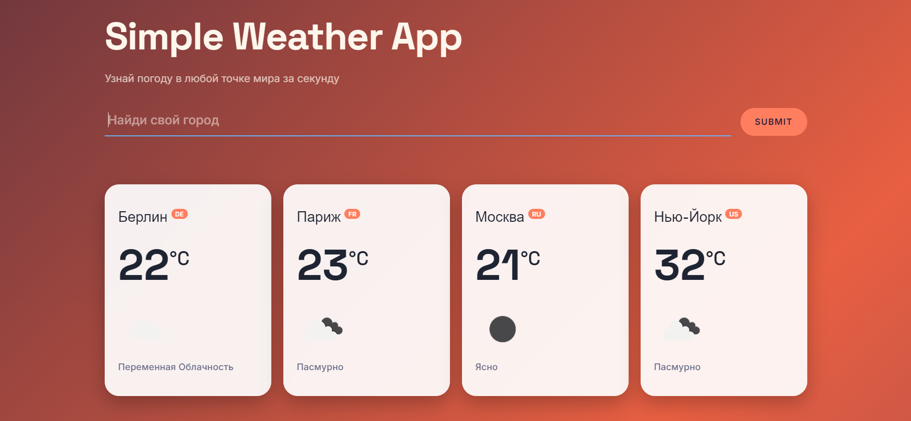

# Simple Weather App 🌤

[](https://sonarcloud.io/summary/new_code?id=Lessorus_Weather-App-Learning-project-)

Приложение для получения актуальной погоды в любом городе мира. Реализовано в рамках производственной практики ПМ.02 — Хекслет колледж.

## Demo

🔗 [Открыть приложение](https://lessorus.github.io/Weather-App-Learning-project-/) ← 

## Скриншот

 ← 

## Стек технологий

- HTML5 (семантическая разметка)
- CSS3 (CSS-переменные, Grid, Flexbox, анимации)
- JavaScript (ES6+, Fetch API, работа с DOM)
- [OpenWeatherMap API](https://openweathermap.org/api)

## Функциональность

- Поиск погоды по названию города (на любом языке)
- Отображение температуры, иконки и описания погоды
- Защита от дублирования — один город не добавляется дважды
- Валидация пустого ввода
- Адаптивный дизайн (mobile, tablet, desktop)

## Запуск локально

```bash
# Клонировать репозиторий
git clone https://github.com/Lessorus/Weather-App-Learning-project-.git

# Открыть index.html в браузере
# или запустить через Live Server в VS Code
```

> Для работы приложения необходим API ключ [OpenWeatherMap](https://home.openweathermap.org/users/sign_up). Вставьте его в `main.js` в переменную `apiKey`.

## Источник

Проект выполнен на основе туториала из каталога [practical-tutorials/project-based-learning](https://github.com/practical-tutorials/project-based-learning):  
[Build a Simple Weather App With Vanilla JavaScript](https://webdesign.tutsplus.com/build-a-simple-weather-app-with-vanilla-javascript--cms-33893t)

## Лицензия

MIT